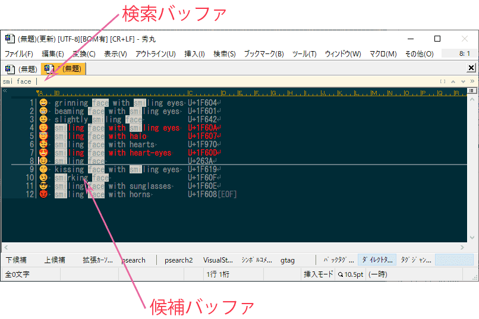

# Unity


[](https://opensource.org/licenses/MIT)

# はじめに

作成途中なのでまだ動かないです。


[unite.vim](https://github.com/Shougo/unite.vim)の秀丸エディタ版。

Emacsでいうところの[anything.el](http://emacs.rubikitch.com/anything/)的存在。

# スクリーンショット（準備中）


# マクロの思想

後で書く

端的に書くと「名詞→動詞」の構文です。


## source（ソース）とは

## kind（カインド）とは


# 画面の名称

二つの画面（バッファ）があります。

- 検索バッファ
- 候補バッファ



## 検索バッファ

検索の候補を入力します。

## 候補バッファ

絞り込み検索した結果をリアルタイムで表示し、操作対象の候補（赤文字の行）を選択します。

# 操作方法

## 検索バッファ

行編集が主なので概ね[Bash](https://www.google.com/search?q=bash)に準拠しています。

### カーソル移動

|キー|説明|備考|
|--|--|--|
|← or Ctrl-b|カーソル左||
|→ or Ctrl-f|カーソル右||
|Home or Ctrl-a|先頭へ||
|End or Ctrl-e|最後へ||


### テキスト編集

|キー|説明|備考|
|--|--|--|
|Del or Ctrl-d or Ctrl-Backspace|Delete||
|Ctrl-t|Transpose||
|Ctrl-k|KillLine||
|Ctrl-u|LineDiscard||
|Ctrl-w|WordRubout||
|Backspace or Ctrl-h|Backspace||


## 候補バッファ

|キー|説明|備考|
|--|--|--|
|↑|前候補へ移動||
|↓|次候補へ移動||
|PageUp|１ページ前へ移動||
|PageDown|１ページ後ろへ移動||
|Ctrl-space|候補をマークする|複数の候補を選択するとき利用します|
|Enter|ディフォルトアクションを実行する||
|Esc|一つ前のバッファに戻る||


## 共通

|キー|説明|備考|
|--|--|--|
|Ctrl-c or Ctrl-q|マクロを終了する||

# マクロの導入方法

まずは、動作確認を行った安定バージョンをダウンロードして下さい。
https://github.com/ohtorii/unity/releases

masterブランチを取得しても多分動作しないです。（動作確認を行っていないため）

## ディレクトリ構成

全ファイルとフォルダを秀丸エディタのスクリプトディレクトリにコピーしてください。

コピー後のディレクトリ構成

```
hidemaru-editor-script-directory
 └unity
    ├─bin
    ├─dll_project
    ├─help
    ├─internal
    ├─kinds
    └─sources
```

## ショートカットキー

`unity_dialog.mac` をショートカットキーに割り当てて下さい。

（例）
- Ctrl-@
- Ctrl-:
- Ctrl-;
- Ctrl-.
- Ctrl-/

コマンド実行っぽいキーを列挙してみました。

## unity_dialog.macを起動する

画像を用意する。

ショートカットキーを押下して`unity_dialog.mac` を起動すると、↑こんなダイアログが開くのでソース(file_mruとかprocessとか)を選んでEnterキーを押下すると絞り込み検索が始まります😙


# いろいろな方法でUnityマクロを呼び出す

以下の表からご自身の都合に合うマクロをショートカットキーに割り当ててご利用ください。
汎用型マクロと特化型マクロの二通りを用意しました。

|ファイル名|説明|ソースの複数選択|オプション選択|
|--|--|--|--|
|unity_dialog.mac						|ダイアログから複数ソースとオプションを指定可能。全機能を利用可能|○|○|
|unity_menu.mac							|メニューからソースを一つ選択して呼び出す。ソースを一つ選択することに特化|×|×|
|unity_menu_manual.mac					|利用頻度の高いソースをメニュー化する例|×|×|
|unity_source_directory.mac				|directroyソースを指定して起動|×|×|
|unity_source_directory_mru.mac			|directroy_mruソースを指定して起動|×|×|
|unity_source_directory_recursive.mac	|directroy_recursiveソースを指定して起動|×|×|
|unity_source_emoji.mac					|emojiソースを指定して起動|×|×|
|unity_source_file.mac					|fileソースを指定して起動|×|×|
|unity_source_file_mru.mac				|file_mruソースを指定して起動|×|×|
|unity_source_file_recursive.mac		|file_recursiveソースを指定して起動|×|×|
|unity_source_hilight.mac				|hilightソースを指定して起動|×|×|
|unity_source_process.mac				|processソースを指定して起動|×|×|
|unity_source_window.mac				|windowソースを指定して起動|×|×|

## 備考

それぞれ数行のマクロで理解しやすいと思います、ヒデマラーの皆様におかれましてはカスタマイズしてお使いください。


# 動作環境

- 秀丸エディタ ver xxx 以降
- 田楽DLL ver 3.22 以降

## 動作確認を行った環境

ご参考までに。

- Windows 10 64bit 
- 秀丸エディタ 64bit ver xxx
- 田楽DLL 64bit ver 3.22

## 備考

秀丸マクロの新命令を利用しているため最新バージョンをお使いください。


# ダウンロード

こちらから動作確認済みのパッケージをダウンロードして下さい。

https://github.com/ohtorii/unity/releases

### 注意
masterブランチを取得しても多分動作しないです。<br>
ブランチを作らずに気楽に開発してます。（仕事じゃないしね😉）

### バージョン番号のルール

バージョン番号の表記方法

バージョン番号は version 1.2.3 のように表記され、それぞれ major.minor.revision を表します。

|番号|説明|
|:--:|:--:|
|major|互換性が失われる大きな変更を表します|
|minor|機能追加のように互換性のある更新を表します|
|revision|バグ修正のように機能そのものに変化が無い軽微な更新を表します|

# その他

## マクロ名について

なぜ、マクロ名をUniteではなくUnityにしたのか？

unite.vimは***コマンド***なのでunite(動詞)の方が自然ですが、秀丸エディタでは***マクロ名***なので名詞にしました。

ゲームエンジンのUnityと同名ですが、それを言い出すとVim-UniteはUnityの大規模イベント（Unite）と同名なので…まあいっか😙とそっと蓋を閉じました😙

|英単語|品詞|説明|
|:--:|:--:|:--:|
|unite|動詞|vim|
|unity|名詞|秀丸エディタ|

## unite.vimとunityマクロの機能対応

unite.vimを秀丸化して移植しています、そのためオリジナル(VIM)の動作と異なる部分があります。

詳細は以下のリンク先を参照してください。（主にVimmer方向け説明です）

[vim_to_hidemaru.md](help/vim_to_hidemaru.md)


# 謝辞

- [unite.vim](https://github.com/Shougo/unite.vim)
- [anything.el](http://emacs.rubikitch.com/anything/)

思想とソースコードをかなり参考にさせてもらいました😘😘😘

# 連絡先

- <https://ohtorii.hatenadiary.jp>
- <https://twitter.com/ohtorii>
- <https://github.com/ohtorii>
