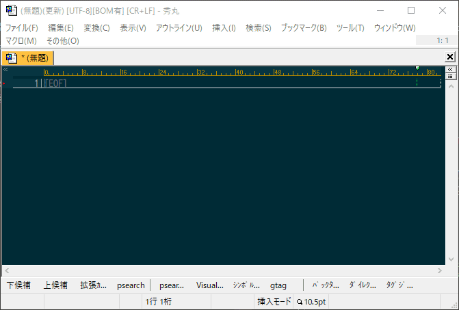
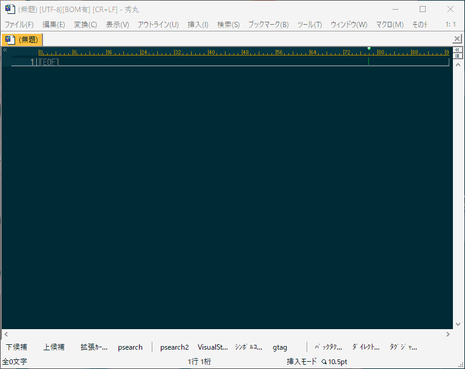
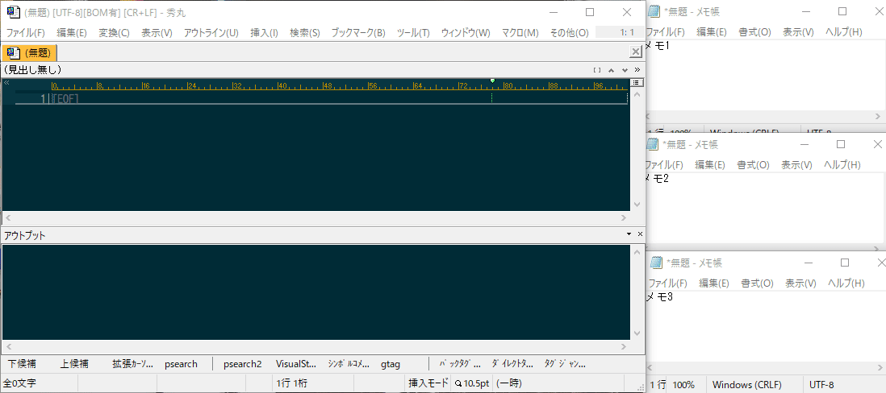
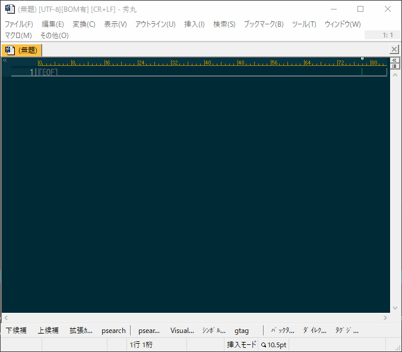
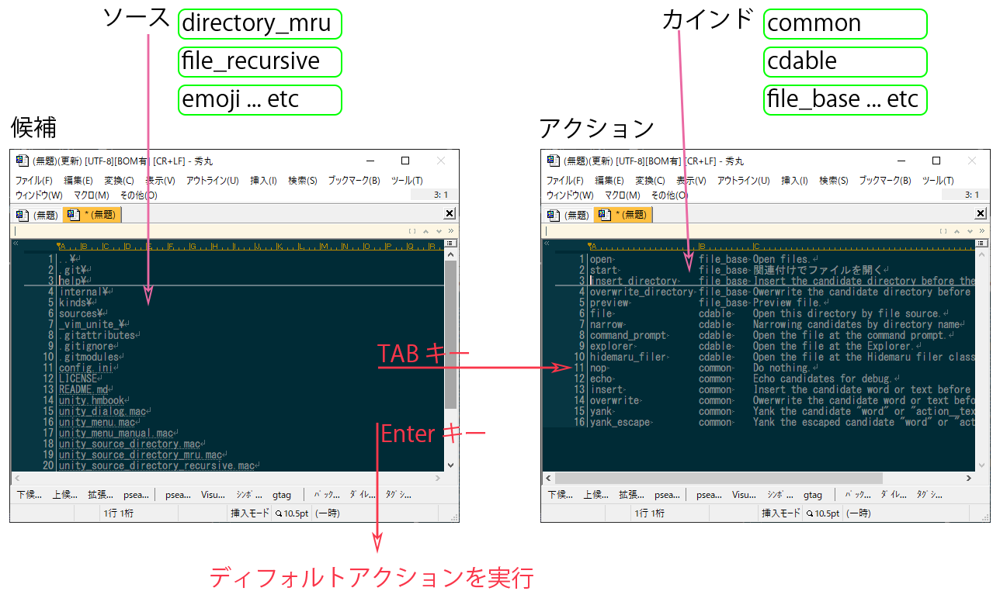
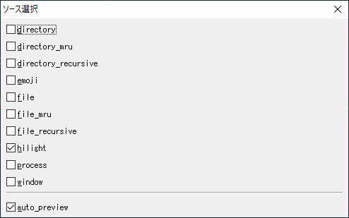

# Unityマクロ


[](https://opensource.org/licenses/MIT)
[](https://scan.coverity.com/projects/ohtorii-unity)

- [はじめに](#はじめに)
- [スクリーンショット](#スクリーンショット)
- [Unityマクロのインターフェース](#unityマクロのインターフェース)
- [Unityマクロ用語](#unityマクロ用語)
- [source（ソース）一覧](#sourceソース一覧)
- [操作方法](#操作方法)
- [マクロの導入方法](#マクロの導入方法)
- [動作環境](#動作環境)
- [ダウンロード](#ダウンロード)
- [ソースとカインドを作成する](#ソースとカインドを作成する)
- [その他](#その他)
- [謝辞](#謝辞)
- [連絡先](#連絡先)
- [寄付](#寄付)


# はじめに

Unityマクロとは秀丸エディタ用の統合ユーザーインターフェースです。

最初に検索パターンを入力することで一致する対象（ファイル名、ウインドウ名など）を絞り込み、選択した対象を操作（開く、挿入するなど）するインターフェースを提供します。

## ヒデマラー向け説明

[unite.vim](https://github.com/Shougo/unite.vim)の秀丸エディタ版です、Emacsでいうところの[anything.el](http://emacs.rubikitch.com/anything/)的存在です。


# スクリーンショット

## 文字列の挿入



## ファイル履歴(file_mru)を検索してファイルを開く



## ファイル履歴(file_mru)の削除


## プロセスのkill



## auto preview オプション

auto preview オプションをONにすると***previewアクション***を自動的に呼び出します。

### ファイルの場合



#### 備考
ファイルの先頭行をアウトプット枠に表示します。

### ハイライト（強調表示）の場合


#### 備考
秀丸エディタのハイライト（強調表示）を変更すると、ウインドウフォーカスが切り替わり使い勝手が悪いです。
その使いにくさを回避するため事前に手作業でウインドウを分離しました。

# Unityマクロのインターフェース



# Unityマクロ用語

## source（ソース）

候補(candidates)を集めてくる秀丸マクロのこと。

標準のソース一覧

- directory
- directroy_mru
- directroy_recursive
- file
- file_mru
- file_recursive
- emoji
- process
- window
- など

もちろんユーザー作成のソースも自由に追加できます。


## kind（カインド）

候補（candidates）の型に対応した操作(action)をまとめた秀丸マクロです。

標準のカインド一覧

- common
- file
- file_base
- cdable
- process
- window
- など

もちろんユーザー作成のカインドも自由に追加できます。

カインドは複数のactionを持っています、例えばcommonカインドは以下のアクションを持っています。

	(例)
	commonカインド
		nopアクション
		yancアクション
		echoアクション
		insertアクション
		  :
		  :
		など


## action(アクション)

選択した候補に対して行う操作のことです。

アクションは幾つかのフラグを持っています。

- 複数の候補を選択可能か
- ユーザーが編集中のテキストを変更するか
- 操作後すぐに終了するか
- 操作後に新たな候補を生成するか
- ...など


## 画面の名称

二つの画面（バッファ）があります。

- 検索バッファ
- 候補バッファ


### 検索バッファ

検索の候補を空白区切りで入力します、候補は大文字小文字の区別をせずAND検索します。

### 候補バッファ

絞り込み検索した結果をリアルタイムで表示します。

さらに、アクションの対象とする候補を複数選択することができます（赤文字の行）。


# source（ソース）一覧

標準のソース一覧です。

|ソース名|説明|その他|
|--|--|--|
|directory|カレントディレクトリの一覧||
|directory_mru|ディレクトリ履歴||
|directory_recursive|カレントディレクトリ以下のディレクトリ一覧（再帰）|候補を非同期で取得するため、ファイル数が多くてもそれなりに動きます|
|emoji|絵文字（Full Emoji List, v13.0）|http://unicode.org/emoji/charts/full-emoji-list.html|
|file|カレントディレクトリのファイル一覧||
|file_mru|ファイル履歴||
|file_recursive|カレントディレクトリ以下のファイル一覧（再帰）|候補を非同期で取得するため、ファイル数が多くてもそれなりに動きます|
|hilight|強調表示||
|lines|編集中テキストの一行||
|mark|マーク一覧||
|outline|アウトライン枠の内容||
|process|プロセス一覧||
|tab|タブ一覧||
|window|ウインドウ一覧||


# 操作方法

## 検索バッファ

行編集が主なので概ね[Bash](https://www.google.com/search?q=bash)に準拠しています。

### カーソル移動

|キー|説明|備考|
|--|--|--|
|← or Ctrl-b|カーソル左||
|→ or Ctrl-f|カーソル右||
|Home|先頭へ||
|End|最後へ||


### テキスト編集

|キー|説明|備考|
|--|--|--|
|Del or Ctrl-d or Ctrl-Backspace|Delete||
|Ctrl-t|Transpose||
|Ctrl-k|KillLine||
|Ctrl-u|LineDiscard||
|Backspace or Ctrl-h|Backspace||


## 候補バッファ

|キー|説明|備考|
|--|--|--|
|↑|前候補へ移動||
|↓|次候補へ移動||
|PageUp|１ページ前へ移動||
|PageDown|１ページ後ろへ移動||
|Ctrl-space|候補をマークする|複数の候補を選択するとき利用します|
|Ctrl-a|候補を全て選択する||
|Enter|ディフォルトアクションを実行する||
|Esc|一つ前のバッファに戻る||


## 共通

|キー|説明|備考|
|--|--|--|
|Ctrl-w|タブを分離する|タブモード時のみ有効。auto-previewと組み合わせると便利|
|Ctrl-c or Ctrl-q|マクロを終了する||

# マクロの導入方法

まずは、動作確認を行った安定バージョンをダウンロードして下さい。

https://github.com/ohtorii/unity/releases

masterブランチは動作確認を行っていないため動作しないです。（仕事じゃないので気楽に開発してます☺）

## ディレクトリ構成

全ファイルとフォルダを秀丸エディタのスクリプトディレクトリにコピーしてください。

コピー後のディレクトリ構成

```
hidemaru-editor-script-directory
 └unity
    ├─help
    ├─internal
    ├─kinds
    └─sources
```

## 依存DLLのインストール

本マクロを動かすには以下のDLLが必要です、それぞれダウンロードして導入してください。

- [田楽DLL 32bit](http://www.ceres.dti.ne.jp/~sugiura/hidemaru/macros/dgserver/#download64)
- [田楽DLL 64bit](http://htom.in.coocan.jp/macro/macro_dll.html#label-5)

32bitと64bit版があります、適切なDLLを導入してください。導入方法はそれぞれのドキュメントを参照しください。

### 補足

***田楽DLL***とはGUI表示などを行うDLLです。


## ショートカットキー

`unity_dialog.mac` をショートカットキーに割り当てて下さい。

（例）
- Ctrl-@
- Ctrl-:
- Ctrl-;
- Ctrl-.
- Ctrl-/

コマンド実行っぽいキーを列挙してみました。

## unity_dialog.macを起動する

ショートカットキーを押下して`unity_dialog.mac` を起動すると、


↑こんなダイアログが開きます。

ソース(file_mruとかprocessとか)を選んでEnterキーを押下すると絞り込み検索が始まります😙


## いろいろな方法でUnityマクロを呼び出す

以下の表からご自身の都合に合うマクロをショートカットキーに割り当ててご利用ください。

汎用型マクロと特化型マクロの二通りを用意しました、それぞれ数行のマクロで理解しやすいと思います。上級ヒデマラーの皆様におかれましてはカスタマイズしてお使いください。

|ファイル名|説明|ソースの複数選択|オプション指定|ソースの引数指定|
|--|--|--|--|--|
|unity_dialog.mac						|ダイアログから複数ソースとオプションを指定可能|○|○|×|
|unity_file_argument.mac				|fileソースへ引数を渡す|×|×|○|
|unity_file_paths.mac					|ファイルパスに関するソース（file,directroy_mru,file_mru）を指定して起動|○|×|×|
|unity_menu.mac 						|メニューからソースを一つ選択して呼び出す。ソースを一つ選択することに特化|×|×|×|
|unity_menu_manual.mac					|利用頻度の高いソースをメニュー化する例|×|×|×|
|unity_source_directory.mac 			|directroyソースを指定して起動|×|×|×|
|unity_source_directory_mru.mac 		|directroy_mruソースを指定して起動|×|×|×|
|unity_source_directory_recursive.mac	|directroy_recursiveソースを指定して起動|×|×|×|
|unity_source_emoji.mac 				|emojiソースを指定して起動|×|×|×|
|unity_source_file.mac					|fileソースを指定して起動|×|×|×|
|unity_source_file_mru.mac				|file_mruソースを指定して起動|×|×|×|
|unity_source_file_recursive.mac		|file_recursiveソースを指定して起動|×|×|×|
|unity_source_hilight.mac				|hilightソースを指定して起動|×|×|×|
|unity_source_outline.mac				|outlineソースを指定して起動|×|×|×|
|unity_source_process.mac				|processソースを指定して起動|×|×|×|
|unity_source_tab.mac					|tabソースを指定して起動|×|×|×|
|unity_source_window.mac				|windowソースを指定して起動|×|×|×|


## 動作環境のカスタマイズ(config.ini)

`config.ini`を環境毎に編集してください。

	;秀丸ファイラーClassicへのパス
	[hidemaru_filer_classic]
	path_x64="C:\Program Files\HmFilerClassic\HmFilerClassic.exe"
	path_x86="C:\Program Files (x86)\HmFilerClassic\HmFilerClassic.exe"

	;引数の詳細は「秀丸ファイラーClassic　ヘルプ　→　起動時のオプション」を参照してください。
	arguments="/t /select,"

	;ディフォルトの動作に任せる場合
	;arguments=""


	;アクション固有の設定
	[action]
	;アクション実行後に待機する時間(ミリ秒)
	;ウインドウ、ハイライトのプレビューなどから参照。
	sleep=1500

通常はディフォルトのままで良いです、もし不都合あれば編集してください。

# 動作環境

- 秀丸エディタ ver 8.91 以降

秀丸マクロの***新命令***を利用しているため***必ず上記バージョン以降***をお使いください。

## 動作確認を行った環境

ご参考までに。

### 64 bit  環境

- Windows 10 64bit 
- 秀丸エディタ 64bit ver 8.91
- 田楽DLL 64bit ver Ver.3.22.1

### 32 bit  環境

- Windows 10 64bit 
- 秀丸エディタ 32bit ver 8.91
- 田楽DLL 32bit ver Ver.3.22.1

# ダウンロード

こちらから動作確認済みのパッケージをダウンロードして下さい。

https://github.com/ohtorii/unity/releases

## 注意
masterブランチを取得しても多分動作しないです。

ブランチを作らずに気楽に開発してます。（仕事じゃないしね😉）

## バージョン番号のルール

バージョン番号の表記方法

バージョン番号は version 1.2.3 のように表記され、それぞれ major.minor.revision を表します。

|番号|説明|
|--|--|
|major|互換性が失われる大きな変更を表します|
|minor|機能追加のように互換性のある更新を表します|
|revision|バグ修正のように機能そのものに変化が無い軽微な更新を表します|


# git clone で取得する場合

クローンと同時にサブモジュールもクローンするために、以下コマンドを実行してください。

> git clone --recursive https://github.com/ohtorii/unity.git

サブモジュールをクローンしないと色々と動かないです😢


# ソースとカインドを作成する方法

[ドキュメントを準備中です。](./help/extension.md)


# その他

ここに書き切れない情報を以下ドキュメントにまとめました。

[help/README.md](help/README.md "README")


# 謝辞

## 思想とソースコードをかなり参考にさせてもらいました😘😘😘
- [unite.vim](https://github.com/Shougo/unite.vim)
- [anything.el](http://emacs.rubikitch.com/anything/)

## 参考書籍

- [Vimテクニックバイブル](https://gihyo.jp/dp/ebook/2012/978-4-7741-5131-1)
- [Emacsテクニックバイブル](https://gihyo.jp/dp/ebook/2012/978-4-7741-5132-8)

## 作者に感謝
- [田楽DLL 32bit](http://www.ceres.dti.ne.jp/~sugiura/hidemaru/macros/dgserver/#download64)
- [田楽DLL 64bit](http://htom.in.coocan.jp/macro/macro_dll.html#label-5)

# 連絡先

- <https://ohtorii.hatenadiary.jp>
- <https://twitter.com/ohtorii>
- <https://github.com/ohtorii>

# 寄付

もし気に入ってくれたらSteamからゲームを寄付してくれるとうれしいです😘
- https://store.steampowered.com/wishlist/id/ohtorii

開発の励みになります。
