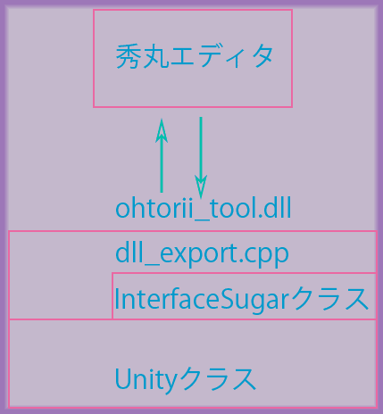

# ohtorii_tools.dll について

- [はじめに](#はじめに)
- [フォルダ構成](#フォルダ構成)
- [ビルド手順](#ビルド手順)
- [レイヤー構成](#レイヤー構成)
- [実装の詳細](#実装の詳細)
- [固有名詞について](#固有名詞について)
- [その他](#その他)
- [最後に](#最後に)

# はじめに

ohtorii_tools.dllはUnityマクロの中心となるDLLです。

このDLLを保守する目的で全体を俯瞰するドキュメントを用意しました。

# フォルダ構成

	ohtorii_tools
	├─ohtorii_tools.sln  //VisualStudioのソリューションファイル
	├─ohtorii_tools      //ソースコード
	└─external           //外部ライブラリ
	   ├─cereal
	   └─libguess

# ビルド手順

ohtorii_tools.sln をVisualStudioで開いてビルドしてください。

x86/x64 版の設定があります、それぞれビルドしてください。

## ビルド環境

Visual Studio 2017

# レイヤー構成

## DLLインターフェース

|ファイル|説明|備考|
|--|--|--|
|Source.def|DLLからエクスポートする関数定義||
|dll_export.cpp|DLLインターフェースの実装||
|interface_sugar.*|秀丸マクロ側の記述を簡易にする機能|難しいインターフェースを糖衣(Suger)で包み利用しやすくする|

## メイン処理

|ファイル|説明|備考|
|--|--|--|
|unity.*|処理の本体||
|sources.*|ソースの処理||
|candidates.*|候補の処理||
|kinds.*|カインドの処理||
|inheritance.*|カインドの継承を処理する||
|refine_search.*|検索処理||

## 非同期処理

|ファイル|説明|備考|
|--|--|--|
|recurring_task.*|定期処理||
|callback.*|コールバック処理||
|async_files.*|テキストファイルを非同期で読み込み候補へ追加します||
|auto_preview.*|テキストファイルのauto-previewを行います。||

## 状態

|ファイル|説明|備考|
|--|--|--|
|context_status.*|コンテキスト毎の状態||
|static_statuc.*|プロセスをまたぐ静的な状態||
|user_data.*|ユーザーデータ||

## その他

|ファイル|説明|備考|
|--|--|--|
|hidemaru_functions.*|秀丸エディタへの関数ポインタ||
|file.*|ファイル処理||
|log.*|ログ出力||

# 実装の詳細

## シリアライズについて

秀丸エディタはマルチプロセスで動作しています、そのため、プロセスをまたいでデータをやりとりする目的でシリアライズのライブラリ([cereal](https://uscilab.github.io/cereal/index.html))を利用しています。

このライブラリは生ポインタをシリアライズできません、生ポインタの代わりにstd::shared_ptrを利用することでポインタをシリアライズできます。
このような事情があるため本DLLでは所々でstd::shared_ptrを利用しています。

絞り込み検索の時にシリアライズを行っています、そのため絞り込み検索に必要な情報だけをシリアライズしています。

詳細は以下のシリアライズを行うメソッドを参照してください。

- Unity::serialize
- Unity::SerializeStaticContext
- Unity::DeSerializeToStaticContext
- Unity::SerializeStaticStatusContext
- Unity::DeSerializeToStaticStatusContext

## 機能の呼び出し方

あらゆる機能はUnity::Instance()を介して呼び出します。

（呼び出し方の例）

	Unity::Instance().lock()->QueryXXX()
	//XXXには機能名が入ります。(Kinds,Sources,StaticStatus...)

具体例は dll_export.cpp を参照してください。

# 固有名詞について

ohtorii_tools.dllで利用している固有名詞について説明します。

## コンテキスト(context)

候補の絞り込み検索と選択候補に対するアクション実行に必要な情報です。

コンテキストに含まれる情報の例。

- 候補
- 絞り込み検索
- 非同期ファイル
- コンテキスト毎の状態
- ユーザーデータ

秀丸エディタ側でTABキーを押下すると次のコンテキストへ切り替わり、ESCキーを押下すると直前のコンテキストへ戻ります。

# その他

file_baseカインドのpreviewアクションをauto_previewオプションと組み合わせたときに、ファイル先頭の数行をアウトプット枠に表示しています。
GUIをフリーズ状態にしないためファイルを非同期で読み込む必要があります、しかし、秀丸マクロでは実現できないため本DLL中でファイルの非同期読みとアウトプット枠への表示を行っています
。

このDLLはカインドに依存しない処理だけ行うべきです。

秀丸マクロは秀丸エディタの操作に特化しており扱いやすい反面、高級言語（C++,C#,Pythonなど）で当たり前の機能（構造体、非同期処理など）がありません。

秀丸マクロの弱みを補うため本DLL中でカインド固有の処理を記述しました。

# 連絡先

- <https://ohtorii.hatenadiary.jp>
- <https://twitter.com/ohtorii>
- <https://github.com/ohtorii>
